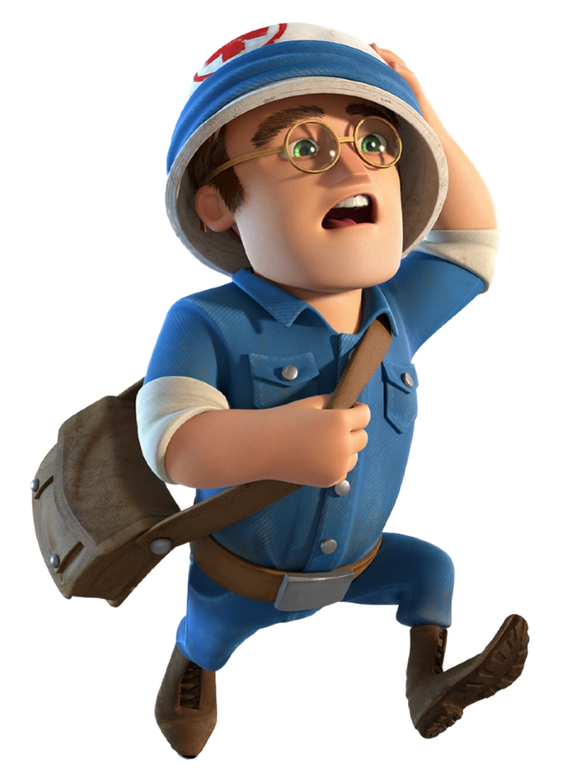
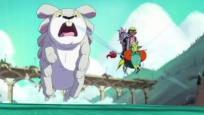
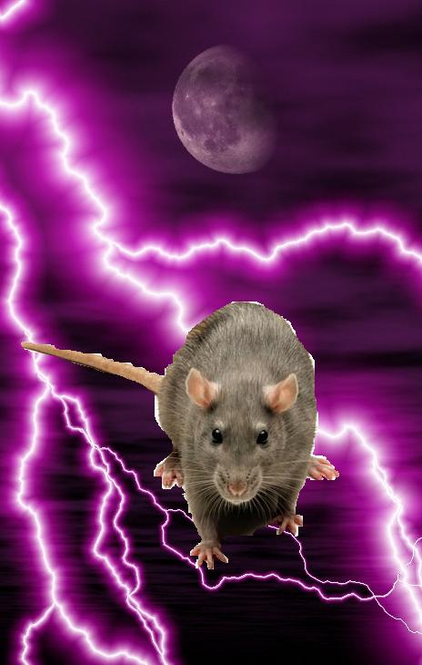

<style>
  .phb#p1{ text-align:center; }
  .phb#p1:after{ display:none; }
</style>

<div style='margin-top:450px;'></div>

# Legend of the Invasion of the Gigantic Drunken Cat

<div style='margin-top:25px'></div>
<div class='wide'>

## <br id="space#0">

### A Wargaming Simulation By Clark & Garret Hoffman

#### <br id="space#100">

##### In a forgotten universe of barbarism, in an era of terror and mysticism, a virtual reality programmer and a spy try to find vengance and battle crime

</div>

\page

<div class='toc'>

# Table Of Contents

- **[1 Invasion of the Gigantic Cat](#p1)**
- **[2 Character Units](#p3)**
  - [2.1 Stats](#p3)
    - [2.1.1 Attack](#p3)
    - [2.1.2 Defense](#p3)
    - [2.1.3 Range](#p3)
    - [2.1.4 Speed](#p3)
    - [2.1.5 Points](#p3)
  - [2.2 Example Units](#p3)
    - [2.2.1 Sample Unit:](#p3)
    - [2.2.2 Standard Units](#p3)
- **[3 Cover](#p6)**
  - [3.1 Buildings](#p6)
  - [3.2 Difficult Terrain](#p6)
- **[4 Setup](#p7)**
  - [4.1 Army building](#p7)
  - [4.2 Map](#p7)
  - [4.3 Decide who goes first](#p7)
- **[5 Gameplay](#p8)**
  - [5.1 Unit Actions](#p8)
    - [5.1.1 Move](#p8)
    - [5.1.2 Attack](#p8)
    - [5.1.3 Defense](#p8)
- **[6 Optional/Prototype Rules](#p9)**
  - [6.1 Gem Harvesting](#p9)
    - [6.1.1 In game effects](#p9)
  - [6.2 Necromancy](#p9)
  - [6.3 Vehicles](#p9)
  - [6.4 Co-op Mode](#p9)
    - [6.4.1 Example Mega-Units](#p9)

</div>

\page

# Character Units

Units or Characters are individual actors in CGWSSOD, they have the following statistics (stats).  All units are small (takes up 1 space), unless otherwise stated.

## Stats

### Attack Power

Abbreviated "A" or "Atk".  This score represents a number of dice or cards that the unit attacks with.  If playing with cards, the attack is played from a hand of 5-7 cards, if playing with dice the type of dice are selected in advance.  When one unit attacks another unit it places that number of cards or rolls that number of dice on the field.  This is measured against the opponents **"Defense"**.  For a normal unit this can be between 1 and 5.

### Defense

Abbreviated "D" or "Def".  This score represents how well a character can defend itself against incoming **Attacks**.  In order to defend against an attack, the player rolls the number of dice or plays a number of cards equal to the score.  For a normal unit, this can be between 1 and 5.

### Range

Abbreviated "R" or "Rng".  This score represents how far a unit can attack in squares or hex.  For a normal unit this can be between 0 and 9.  Zero meaning that the units have to be on top of eachother, and 9 being nine whole squares away.

### Speed

Abbreviated "S" or "Spd".  This is how fast a character can move in squares or hex.  For a normal unit this can be between 1 and 4.

### Points

Abbreviated "P" or "Pts".  Points are used for calculating how much a character is worth.  For general units the formula is the sum of all the general stats (**Attack** through **Speed**), divided by 2 rounded down.  Points may be adjusted after the fact for special abilities.

```why isn't column break working?
```

## Example Units

### Sample Unit

Use this sample unit as a template to make more units.
___
>
> ## Sample Unit #1
>
> <hr>
>
>*Small humanoid, likes dolphins.*
> <hr>
>
> Symbol: 😀
> <hr>
>
>|Atk|Def|Rng|Spd|Pts|
>|:-:|:-:|:-:|:-:|:-:|
>| 1 | 2 | 3 | 3 | 5 |
> <hr>
>
> ***Special Ability.*** This unit has a really cool special ability worth 1pt making its total pts 5 instead of 4.
>

### Standard Units

Or use these as standard units to fill out your army.
___
>
> ## Glass Cannon
>
> *Hits heavy, but no defense*
> <hr>
>
> Symbol: ??
> <hr>
>
>|Atk|Def|Rng|Spd|Pts|
>|:-:|:-:|:-:|:-:|:-:|
>| 5 | 1 | 3 | 2 | 4 |
> <hr>
>
> The glass cannon is a heavy hitter, but low on defenses, and speed.

\page
___
> </img>
>
> ## Medic Guy
>
> *Help, I need somebody!*
> <hr>
>
> Symbol:
> <hr>
>
>|Atk|Def|Rng|Spd|Pts|
>|:-:|:-:|:-:|:-:|:-:|
>| 1 | 1 | 2 | 5 | 6 |
> <hr>
>
> ***Heal.*** This unit has the ability to raise downed units.  In order to do this, the Medic must occupy the same space as the downed unit, and use its entire *Attack Action* to heal.

___
>
> ## Trooper Guy
>
> *Standard Human, ready to rock or be rocked*
> <hr>
>
> Symbol:
> <hr>
>
>|Atk|Def|Rng|Spd|Pts|
>|:-:|:-:|:-:|:-:|:-:|
>| 1 | 1 | 1 | 1 | 2 |
> <hr>
>
> No special abilities, nothing special about this guy...

___
>
> ## Swordsman Guy
>
> *Heavy hitter, but only in close combat.*
> <hr>
>
> Symbol:
> <hr>
>
>|Atk|Def|Rng|Spd|Pts|
>|:-:|:-:|:-:|:-:|:-:|
>| 5 | 5 | 0 | 1 | 6 |
> <hr>
>
> Zweihander wielding monster.  Lots of attack and defense power, but not much else
>
> ***Sword Throw***.  The swordsman may make a ranged attack at Rng:1, when he does so his Atk is reduced to 1 until he regains the use of his sword.  In order regain his sword the Swordsman must be in the same space as his sword, and use an *Attack action* to pick it up.
>

___
>
> ## Sniper Guy
>
> *Heavy hitter at range.*
> <hr>
>
> Symbol:
> <hr>
>
>|Atk|Def|Rng|Spd|Pts|
>|:-:|:-:|:-:|:-:|:-:|
>| 5 | 1 | 9 | 1 | 7 |
> <hr>
>
> The sniper is great at ranged combat, but not great if you get the jump on him.
>

___
>
> ## Pistol Guy
>
>*Has a pistol.*
> <hr>
>
> Symbol:
> <hr>
>
>|Atk|Def|Rng|Spd|Pts|
>|:-:|:-:|:-:|:-:|:-:|
>| 2 | 2 | 3 | 2 | 5 |
> <hr>
>
> ***Pistol Whip.*** This character can make an extra attack at Atk:3 when on top of another unit (Rng:0).

\page
___
>
> ## Rocket Launcher Guy
>
>*Small humanoid, likes dolphins.*
> <hr>
>
> Symbol:
> <hr>
>
>|Atk|Def|Rng|Spd|Pts|
>|:-:|:-:|:-:|:-:|:-:|
>| 5 | 1 | 4 | 2 | 8 |
> <hr>
>
> ***Blast Attack.*** When the rocket launcher guy attacks, he selects a space instead of a unit.  That space experiences an explosion that emanates outwards in all directions.  Explosions deal max Atk at the center of the blast, and half as much for each space outwards to a minimum of 1. (For example an Atk:5 explosion would deal Atk:5 at its epicenter but Atk:2 just one space out, and Atk:1 two spaces out.)
>
> ***Push Back.*** All small creatures within the ***Blast Attack*** are pushed 1 space away (a creature at the center of the blast is pushed in a direction of the attackers chosing).
>

\page

# Cover

Cover in CGWSSOD can come in a number of different shapes and sizes, but generally comes in two different types **"Buildings"** and **"Difficult Terrain"**.  

## Buildings

Buildings generate full cover when there is no line of sight between units.  When there is line of sight to part of a unit, buildings generate partial cover, meaning that the character adds 1 unit to its **Defense** stat.  Units cannot go through buildings, unless there are doors or windows.  Going through a closed door consumes 1 extra speed for opening the door, going through a closed window consumes 2 extra speed for both opening the window, then traversing the difficult tertain of the wall beneath the window.

## Difficult Terrain

Units can attack through difficult terrain, but at a disadvantage.  Add 1 extra defense to any units being attacked through difficult terrain at a distance, and 2 extra defense to any units actively using difficult terrain as cover.  In order to use difficult terrain as cover the unit must be immediately adjacent to the difficult terrtain.  Units can traverse difficult terrain, but also at a disadvantage.  It takes 1 extra speed any time a unit moves through terrain marked as difficult.

\page

# Setup

## Army building

Players must first build their armies from a selection of characters or units.  Standard army generation is 30 points, but for larger battles may be arranged for more points or fewer points for smaller battles.  Players may also agree on a "handycap" ahead of time.  Each player will expense the number of points for each unit up to but not exceeding their point buy max.

## Map

Randomly generate cover on the map by placing **Buildings** and **Difficult Terain**.  Players place their units on the map strategically in mutitally agreed upon starting areas.

## Decide who goes first

Roll the dice to see who goes first, argue about the results.

\page

# Gameplay

After deciding which player goes first... play is resolved one player at a time.  Each player decides how much a particular unit moves and/or if that unit attacks and what it attacks.  Movement and Attacks can be resolved all at once, or saved until the end.  For example, a unit may chose to move, then attack, or a unit may move attack, then move again.  In general units only get one attack per round, and can only move up to their **"Speed"**.  Once a player has consumed all of his unit's "Actions" they are done for that round, and play moves on to the next player.

## Unit Actions

### Move Action

A unit may move a number of spaces up to its full movement speed.

### Attack Action

When a unit makes an attack with its *Attack* stat.  The player rolls the number of dice on the attack stat.  The defending player rolls the number of dice specified by their unit's *Defense* stat.  If the attacker wins, the the defending unit is turned over signifying that they are dead or dying.  If the defender wins, nothing happens.

### Substituting Actions

#### Full Defense

A unit may decide to make a full defensive action instead of making an *Attack* action.  Add one to its defense stat until the next round.  Add an additional point of defense if the unit also forgoes its *Move* action.

#### Full Attack

A unit may decide to forgo its *Move* action to attack twice.  In this case, subtract one from its *Atk* score for all attacks made within this round.

#### Full Move

A unit may decie to forgo its *Attack* action for extra movement speed.  In this case, double the unit's movement speed for this round.

### Optional Rule: Playing with Cards instead of Dice

If the players decide to play with cards instead of dice, shuffle and draw hands of 5 to 7 cards.  The *Attack* and *Defense* stats now represent how many cards may be played.  Sum the cards in the play just as you would dice.

#### Double + Optional Rule: playing with cards rules

Instead of just summing cards, add extra damage, defense, effects for the following plays:

| Play |Explanation| Extra Points/Effect |
|:----:|:---------:|:-------------------:|
| Pair|2 Cards with the same value| +2 to Play Value |
| 3-Kind|3 Cards with the same value| +3 to Play Value |
| Straight|Cards are sequential| Add the number of cards in sequence to the value of the Play |
| Flush|Cards are same suit| Add the number of cards in the same suit to the value of the Play |
| Four of a Kind|4 Cards with teh same value| +4 to Play Value |
| Straight Flush|(3+ cards) Cards are both all one suit, and sequential|Play gains a Burst Effect for everyone in the vicinity of the play (Rng:1, Atk:2) (The effect is centered on the unit making the Attacking/Defending action).|
| Royal Flush|Play is both a Straight Flush and ends in an Ace| +6 to Play Value, and Burst Effect from Straight Flush.|

\page

# Optional/Prototype Rules

## Gem Harvesting

Roll a number of dice out on the board.  Players may "capture" these dice using their units for a number of in game effects.  The Gem's value may be determined by the number of sides on the dice, or the value facing up.  The effect may be immediate (when a player captures a gem), or delayed (the unit must return the gem to a "base" location to activate its effect.

### In game effects

#### Capture the flag mode

The player who captures the most gems wins the match.  The match is over when either a player is out of units *or* all of the gems are captured.

#### Gems as point buy

A player may, on their turn, buy additional units with the gems they've collected.  The additional units must start from a designated starting area.

## Necromancy

When a unit dies in battle the attacking player divides the units points by 2 (round down), and adds that number to their "Necromancy Pool".  The player may then use that pool for point buy to create new units on their turn.

## Vehicles

A vehicle is just another unit, but may have much larger attack, defense, and speed stats.  A vehicle is required to have a driver, which can be any standard character unit.  It has an additional stat for how many units it can cary.

## Called Shot

A unit may substitute all of its actions for a particular round to *"Take Aim"* at another unit.  In this case, increase the dice that are used for its *Atk* stat by one level for the ***next*** round of combat, but only for the creature that the attacking unit targets in the previous round. For example: 4d6 ==> 4d8, 2d8 ==> 2d10, etc, but if the target creature falls or the player decides to target another creature Atk is reduced to its normal value.

```na
```

## Co-op Mode

Designate a game-master, and give the game master a number of points equal to the sum of the points of the players (plus or minus, depending on handycap).  The game-master may use this sum to point-buy a handful of standard units, or one or two mega-units (units which are larger and more powerful than standard units).  Mega-units generally take up multiple spaces on the map.  They also have an additional stat for health.  Any time an *attack* passes its *defense* its health decreases by one point.

\page

### Example Mega-Units

___
___
> <div></img></div>
>
> ## Mega Bunny
>
> *Aww, its soo fuzzy and cute, and omgwtfbbq on a stick, its trying squish and/or eat me.*
> <hr>
>
> - **Symbol:**
> - **Size:** 3x4 Spaces
>
> <hr>
>
>|Atk |Def|Rng|Spd| Hp |Pts |
>|:--:|:-:|:-:|:-:|:-: |:--:|
>| 10 | 4 | 0 | 1 | 10 | 15 |
> <hr>
>
> ***Hop.*** Mega-Bunnies can only move 1 in any direction by walking, but can instead chose to "hop".  While hopping, Mega-Bunnies can move up to 10 spaces, but only in a straight line.
>
> ***Large.*** Mega-Bunnies are large creatures.  They consume 3 spaces by 4 spaces. They can also scale *Buildings* as if they are only *Difficult Terrain* instead of solid.  Mega-Bunnies still treat *Buildings* as *Difficult Terrain* while *Hopping*.  
>

\page

<!-- markdownlint-disable no-trailing-punctuation-->
# More Units than You Know What to do With!
<!-- markdownlint-endable no-trailing-punctuation-->
___
> </img>
>
> ## Lightning Rat
>
>*Like Picachu but Meaner.*
> <hr>
>
> Symbol:
> <hr>
>
>|Atk|Def|Rng|Spd|Pts|
>|:-:|:-:|:-:|:-:|:-:|
>| 1 | 3 | 2 | 4 | 7 |
> <hr>
>
> ***Lightning Bolt.*** The lightning rat can optionally use its entire turn (Action, Movement, and All) to call lightning down from the sky, dealing Atk:5 on a single unit within Rng:1
>
> ***Chain Lightning.*** If the opposing player's units are wihin 2 spaces of one another, the lightning Rat can chain lightning attacks between them.  It makes an Atk:2 per unit, and the starting unit must be within Rng:2 of the lightning rat.  The lightning rat may even use its own teammates to accomplish this chain attack, in which case, the teammate must also make a defense roll.
>
